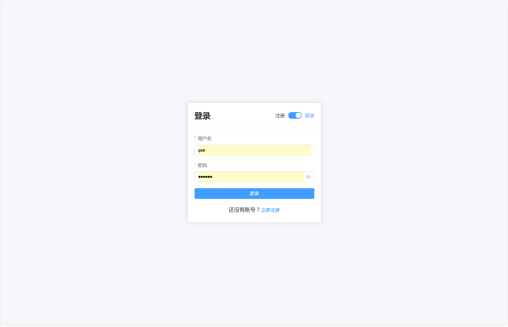
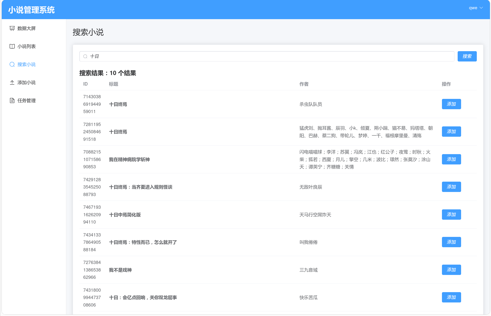
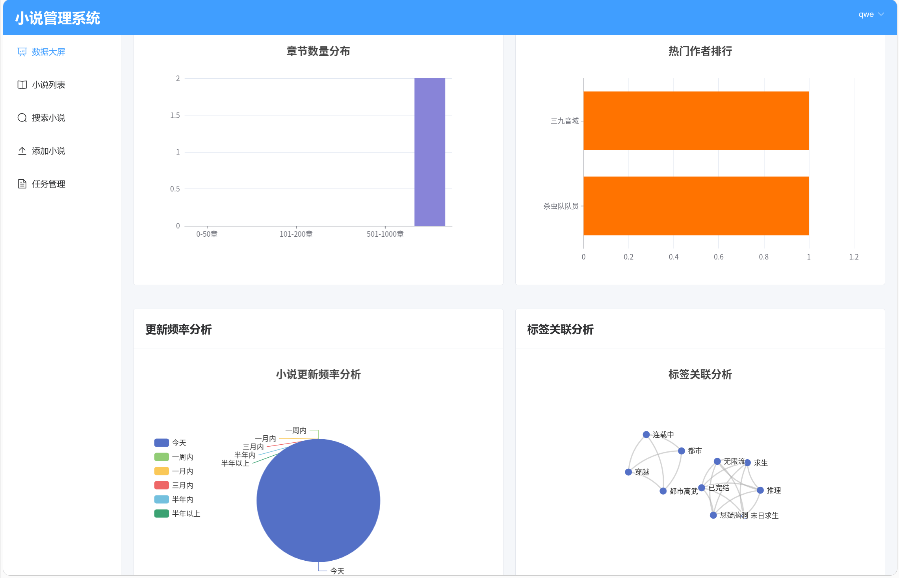

# Fanqie Reader - 番茄小说阅读器（增强版）

> 🎯 本项目 Fork 自 [huahuadeliaoliao/fanqie-reader](https://github.com/huahuadeliaoliao/fanqie-reader)，在原有基础上进行了大量功能增强和优化。

一个用于可视化爬取、管理和阅读番茄小说的 Web 应用。它允许用户搜索番茄网的小说，将其加入下载队列，跟踪下载进度，在线阅读，并查看一些基本的统计信息。

## 🚀 主要增强功能

本 Fork 版本相比原项目做出了以下重大改进：

### 1️⃣ 内部 API 模式支持
- ✅ **移除 JWT 认证**：可作为内部服务使用，无需登录
- ✅ **跨用户任务管理**：支持查看和操作所有用户的任务
- ✅ **简化部署**：前端无需登录即可访问所有功能
- 📚 详见：[CHANGELOG_INTERNAL_MODE.md](CHANGELOG_INTERNAL_MODE.md)、[INTERNAL_API_SETUP.md](INTERNAL_API_SETUP.md)

### 2️⃣ API 功能大幅增强
- 🔍 **搜索接口增强**：返回封面、简介、分类、评分等完整信息
- 📊 **多维度筛选**：支持标题搜索、标签筛选、状态筛选
- 🔢 **灵活排序**：支持按更新时间、创建时间、章节数、标题排序
- 🎯 **组合查询**：支持多条件组合查询，提升 API 易用性
- 📚 详见：[API_ENHANCEMENTS_SUMMARY.md](API_ENHANCEMENTS_SUMMARY.md)、[API_DOCUMENTATION.md](API_DOCUMENTATION.md)

### 3️⃣ 前端搜索页面美化
- 🎨 **卡片式布局**：从表格布局升级为现代化卡片网格布局
- 🖼️ **封面展示**：显示小说封面图片，支持懒加载
- ⭐ **评分标签**：直观显示小说评分
- 📝 **简介预览**：显示小说简介（最多 3 行）
- 📱 **响应式设计**：完美适配移动端和桌面端
- 📚 详见：[FRONTEND_SEARCH_ENHANCEMENT.md](FRONTEND_SEARCH_ENHANCEMENT.md)

### 4️⃣ 章节限制下载（预览模式）
- ⚡ **快速预览**：支持仅下载前 N 章（默认 10 章）
- 💾 **节省资源**：预览模式节省 90% 的下载时间和存储空间
- 🎯 **双按钮设计**：「下载全本」和「前十章预览」独立操作
- 📚 详见：[FEATURE_MAX_CHAPTERS.md](FEATURE_MAX_CHAPTERS.md)、[UPDATE_SUMMARY.md](UPDATE_SUMMARY.md)

### 5️⃣ 下载稳定性优化
- 🔧 **批次大小优化**：从 10 章/批降至 5 章/批，提高成功率
- ⏱️ **等待时间调整**：增加请求间隔，降低 API 限流风险
- 🔄 **重试机制完善**：内置指数退避重试策略
- 🌐 **代理绕过支持**：避免本地代理导致的 SSL 握手错误
- 📚 详见：[BATCH_DOWNLOAD_OPTIMIZATION.md](BATCH_DOWNLOAD_OPTIMIZATION.md)、[TROUBLESHOOTING_JSONDecodeError.md](TROUBLESHOOTING_JSONDecodeError.md)

### 6️⃣ 配置和部署优化
- 🐛 **修复 .env 解析错误**：规范配置文件格式
- 📝 **配置模板文件**：提供 `.env.example` 模板
- 🔧 **环境变量增强**：支持更多下载参数配置
- 📚 详见：[BUGFIX_ENV_CONFIG.md](BUGFIX_ENV_CONFIG.md)

---

## 📋 完整文档索引

### 核心功能文档
- 📘 [API 完整文档](API_DOCUMENTATION.md) - 所有 API 接口说明
- 📗 [API 增强总结](API_ENHANCEMENTS_SUMMARY.md) - 搜索、筛选、排序功能详解
- 📙 [API 使用示例](API_NOVELS_LIST_EXAMPLES.md) - 实际使用案例
- 📕 [内部 API 快速入门](INTERNAL_API_QUICK_START.md) - 快速上手指南

### 架构和部署
- 🏗️ [系统架构分析](ARCHITECTURE_ANALYSIS.md) - 系统架构详解
- 🔧 [内部 API 配置](INTERNAL_API_SETUP.md) - 4 种鉴权方案说明
- 🔐 [移除用户过滤指南](REMOVE_USER_FILTER_GUIDE.md) - 用户过滤相关

### 功能优化
- ⚡ [章节限制功能](FEATURE_MAX_CHAPTERS.md) - 预览模式说明
- 🎨 [前端搜索增强](FRONTEND_SEARCH_ENHANCEMENT.md) - UI 美化详解
- 🎯 [UI 改进总结](UI_IMPROVEMENTS.md) - 用户体验提升
- 📦 [批量下载优化](BATCH_DOWNLOAD_OPTIMIZATION.md) - 下载稳定性提升

### 问题修复和故障排查
- 🐛 [配置文件 Bug 修复](BUGFIX_ENV_CONFIG.md) - .env 解析错误修复
- 🔍 [JSONDecodeError 排查](TROUBLESHOOTING_JSONDecodeError.md) - 下载错误解决方案
- 🖼️ [搜索封面增强](SEARCH_COVER_ENHANCEMENT.md) - 封面显示优化
- 🚀 [搜索封面预加载](SEARCH_COVER_PRELOAD.md) - 性能优化
- ⚠️ [搜索评分问题](SEARCH_SCORE_ISSUE.md) - 评分字段修复

### 变更日志
- 📝 [内部模式变更日志](CHANGELOG_INTERNAL_MODE.md) - 内部 API 模式完整记录
- 📊 [更新总结](UPDATE_SUMMARY.md) - v1.1.0 更新内容

### 测试脚本
- 🧪 [API 功能测试](test_api_features.ps1) - PowerShell 测试脚本
- 🗑️ [删除任务测试](test_delete_task.ps1) - 任务删除测试
- 🐍 [预览下载测试](test_preview_download.py) - Python 测试脚本
- 🌐 [代理 API 测试](test_proxy_api.ps1) - 代理模式测试

---

## 系统架构详解

本系统采用前后端分离、基于容器化部署的分布式架构，主要由以下服务和模块构成：

### 1. 后端 (Backend - Flask API)

- **技术栈:** Python 3, Flask, Gunicorn, Eventlet, Flask-SQLAlchemy, Flask-JWT-Extended, Flask-SocketIO, Celery API。
- **功能:**
  - 作为核心 API 服务器 (`app.py`)，处理前端的所有 HTTP 请求。
  - **用户认证:** 使用 `auth.py` 蓝图处理用户注册和登录，通过 Flask-JWT-Extended 生成和验证 JWT（可选配置为内部 API 模式）。
  - **API 路由:** 定义 RESTful API 接口：
    - `/api/search`: 搜索小说（支持封面、简介、分类、评分返回）。
    - `/api/novels`: 添加小说下载任务 / 获取小说列表（支持筛选、搜索、排序）。
    - `/api/novels/<id>`: 获取小说详细信息。
    - `/api/novels/<id>/chapters`: 获取章节列表。
    - `/api/novels/<id>/chapters/<cid>`: 获取特定章节内容。
    - `/api/novels/<id>/cover`: 获取封面。
    - `/api/novels/<id>/download`: 下载生成的小说文件。
    - `/api/tasks/*`: 管理下载任务（支持跨用户操作）。
    - `/api/stats/*`: 获取统计数据。
  - **数据库交互:** 通过 SQLAlchemy 操作 MySQL。
  - **任务调度:** 使用 Celery 向 Redis 发布任务。
  - **实时通信:** Flask-SocketIO + WebSocket 实时推送任务进度。
  - **异步处理:** Gunicorn + eventlet 支持并发。
  - **配置管理:** `config.py` 读取 `.env`。
  - **错误处理:** 全局异常捕获，返回标准化 JSON 错误。

### 2. 后台工作程序 (Celery Worker)

- **技术栈:** Python 3, Celery, Redis。
- **功能:**
  - 独立执行后台任务 (`process_novel_task`, `analyze_novel_task`)。
  - 下载章节、生成小说、统计词频、生成词云等。
  - 支持章节限制下载（预览模式）。
  - 与 Flask-SocketIO 联动，更新任务状态。

### 3. 数据库 (MySQL)

- **技术栈:** MySQL 8。
- **数据模型:**
  - `User`: 用户信息。
  - `Novel`: 小说元数据（包含简介、封面等）。
  - `Chapter`: 小说章节内容。
  - `DownloadTask`: 下载任务信息。
  - `WordStat`: 词频统计数据。

### 4. 消息代理 / 缓存 (Redis)

- Celery 的消息中介与结果存储。
- Flask-SocketIO 的消息广播支撑。

### 5. 小说下载器模块 (`novel_downloader`)

- 实现对番茄小说官网或 API 的内容抓取。
- 多线程下载、断点恢复、章节加密解密。
- 批量下载优化（5 章/批），提高稳定性。
- 支持章节限制下载（预览模式）。
- 支持代理 API 和官方 API 双模式。
- 使用 `ebooklib` 生成 EPUB，支持纯文本输出。
- 使用 `jieba` 分词 + `wordcloud` 生成词云图。

### 6. 前端 (Frontend - Vue)

- **技术栈:** Vue 3, Vite, Pinia, Vue Router, Axios, Socket.IO Client, Element Plus。
- **功能:**
  - 小说搜索 / 阅读 / 管理 / 下载任务可视化。
  - 美化的卡片式搜索结果展示（封面、评分、简介）。
  - 双按钮下载模式（全本 / 预览）。
  - 实时进度同步（通过 WebSocket）。
  - 登录/注册状态管理（可选配置为内部 API 模式无需登录）。
  - 使用 Element Plus 提供现代化 UI。

---

## 核心技术栈

- **前端:** Vue 3, Pinia, Vite, Element Plus
- **后端:** Flask, SQLAlchemy, Flask-JWT, Flask-SocketIO, Celery
- **任务调度:** Celery + Redis
- **数据库:** MySQL 8
- **部署:** Docker + Docker Compose

---

## 系统部署（详细说明）

### 先决条件

- Docker Engine
- Docker Compose v2+

### 步骤

1. 克隆项目代码：

```bash
git clone https://github.com/Deng-m1/novel-fanqie-reader.git
cd novel-fanqie-reader
```

2. 配置 `.env` 文件（参考 `.env.example`）：

```dotenv
# 数据库配置
DB_NAME=fanqie_db
DB_USER=fanqie_user
DB_PASSWORD=你的数据库密码
DB_ROOT_PASSWORD=你的root密码

# 安全密钥
JWT_SECRET_KEY=生成一个随机密钥
FLASK_SECRET_KEY=生成一个随机密钥

# Flask 环境
FLASK_ENV=production
FLASK_LOG_LEVEL=INFO
SQLALCHEMY_ECHO=False
TZ=Asia/Shanghai

# 下载配置（推荐）
NOVEL_USE_OFFICIAL_API=false
NOVEL_USE_PROXY_API=true
NOVEL_MAX_WORKERS=3
NOVEL_MIN_WAIT_TIME=3000
NOVEL_MAX_WAIT_TIME=6000
NOVEL_MAX_RETRIES=3

# IID 配置（定期更新）
NOVEL_IID=你的IID
NOVEL_IID_SPAWN_TIME=时间戳
```

3. 启动服务：

```bash
docker-compose up -d --build
```

4. 访问服务：

- **前端:** `http://localhost:5173`
- **后端 API:** `http://localhost:5000`

5. 数据库连接（可选）：

- **地址:** `localhost:3307`
- **用户名:** 在 `.env` 中配置的 `DB_USER`
- **密码:** 在 `.env` 中配置的 `DB_PASSWORD`

---

## API 使用示例

### 搜索小说

```bash
curl "http://localhost:5000/api/search?query=斗破"
```

响应包含封面、简介、分类、评分等完整信息。

### 添加下载任务（完整版）

```bash
curl -X POST http://localhost:5000/api/novels \
  -H "Content-Type: application/json" \
  -d '{"novel_id":"7518662933425966105"}'
```

### 添加下载任务（预览模式）

```bash
curl -X POST http://localhost:5000/api/novels \
  -H "Content-Type: application/json" \
  -d '{"novel_id":"7518662933425966105","max_chapters":10}'
```

### 获取小说列表（带筛选和排序）

```bash
# 搜索标题包含"斗破"的小说，按章节数降序
curl "http://localhost:5000/api/novels?search=斗破&sort=total_chapters&order=desc"

# 筛选"动漫衍生"标签，按更新时间降序
curl "http://localhost:5000/api/novels?tags=动漫衍生&sort=last_crawled_at&order=desc"

# 筛选连载中的小说
curl "http://localhost:5000/api/novels?status=连载中"
```

### 查看任务列表

```bash
curl "http://localhost:5000/api/tasks/list"
```

内部 API 模式下返回所有用户的任务。

---

## 功能展示与截图

- **用户认证:** 注册新用户，登录系统（内部 API 模式下可跳过）。  
  

- **小说搜索:** 输入关键词搜索小说，美化的卡片式布局展示。  
  

- **任务管理:** 查看下载任务列表、进度、状态。  
  

- **小说书架:** 展示成功下载的小说。  
  

- **小说详情:** 查看作者、简介、标签、章节等。  
  

- **在线阅读:** 查看已下载章节的内容。  
  

- **统计数据:** 展示上传、分类统计图表。  
  

- **词云图:** 后台生成小说词频图。  
  

---

## 日常维护

### 查看日志

```bash
# 查看后端日志
docker-compose logs -f backend

# 查看 Celery Worker 日志
docker-compose logs -f celery_worker

# 查看前端日志
docker-compose logs -f frontend
```

### 停止服务

```bash
docker-compose down
```

### 重启服务

```bash
# 重启所有服务
docker-compose restart

# 重启单个服务
docker-compose restart backend
```

### 更新代码

```bash
git pull
docker-compose up -d --build
```

### 备份数据

```bash
# 备份数据库
docker exec fanqie_mysql mysqldump -u root -p fanqie_db > backup.sql

# 备份下载的小说
cp -r backend/data/novel_downloads/ backup/
```

---

## 最佳实践建议

### 1. 首次使用

1. 使用"前十章预览"功能测试下载是否正常
2. 确认预览成功后再下载完整小说
3. 避免短时间内下载大量小说

### 2. 下载策略

- **小说预览:** 先用预览模式（10 章）快速浏览
- **完整下载:** 确认喜欢后再下载全本
- **批量下载:** 每本小说之间间隔 1-2 分钟

### 3. 稳定性优化

- 定期更新 IID（配置在 `.env` 中）
- 遇到下载失败使用"重新下载"功能
- 高峰时段可能成功率较低，建议错峰使用

### 4. 安全建议（内部 API 模式）

- ⚠️ **仅在内网环境使用**内部 API 模式
- 🔒 使用防火墙限制访问来源
- 🌐 公网环境请使用 JWT 认证模式

---

## 常见问题

### 1. JSONDecodeError 错误

**原因:** API 返回空响应或限流  
**解决:** 参考 [TROUBLESHOOTING_JSONDecodeError.md](TROUBLESHOOTING_JSONDecodeError.md)

- 已优化批次大小为 5 章/批
- 已增加请求等待时间
- 可使用"重新下载"功能重试

### 2. .env 配置解析错误

**原因:** 配置文件格式不规范  
**解决:** 参考 [BUGFIX_ENV_CONFIG.md](BUGFIX_ENV_CONFIG.md)

- 不要在配置值后直接添加注释
- 参考 `.env.example` 模板
- 注释必须独立成行

### 3. 搜索结果没有封面

**原因:** 封面字段未返回或加载失败  
**解决:** 参考 [SEARCH_COVER_ENHANCEMENT.md](SEARCH_COVER_ENHANCEMENT.md)

- 已优化封面显示逻辑
- 支持懒加载和错误占位符

### 4. 下载速度慢

**原因:** 批次大小、等待时间设置不当  
**解决:** 参考 [BATCH_DOWNLOAD_OPTIMIZATION.md](BATCH_DOWNLOAD_OPTIMIZATION.md)

- 调整 `NOVEL_MAX_WORKERS` 参数
- 调整 `NOVEL_MIN_WAIT_TIME` 和 `NOVEL_MAX_WAIT_TIME`

---

## 开发指南

### 本地开发环境

#### 后端

```bash
cd backend
pip install -r requirements.txt
python app.py
```

#### 前端

```bash
cd frontend
npm install  # 或 bun install
npm run dev  # 或 bun run dev
```

#### Celery Worker

```bash
cd backend
celery -A tasks worker --loglevel=info
```

### 代码贡献

欢迎提交 PR 或 Issue！

1. Fork 本项目
2. 创建特性分支 (`git checkout -b feature/AmazingFeature`)
3. 提交更改 (`git commit -m 'Add some AmazingFeature'`)
4. 推送到分支 (`git push origin feature/AmazingFeature`)
5. 打开 Pull Request

---

## 变更日志

### v1.2.0 (2025-10-04)
- ✅ API 功能大幅增强（搜索、筛选、排序）
- ✅ 前端搜索页面美化（卡片式布局）
- ✅ 封面、评分、简介显示
- ✅ 响应式设计优化

### v1.1.0 (2025-10-03)
- ✅ 内部 API 模式支持
- ✅ 移除 JWT 认证要求
- ✅ 章节限制下载（预览模式）
- ✅ 双按钮下载设计
- ✅ 批量下载优化（5 章/批）
- ✅ 修复 .env 配置解析错误
- ✅ 代理 API 支持

### v1.0.0 (初始版本)
- 基础功能实现

---

## 致谢

- 感谢原项目 [huahuadeliaoliao/fanqie-reader](https://github.com/huahuadeliaoliao/fanqie-reader) 提供的基础框架
- 感谢所有贡献者和用户的反馈

---

## 许可证

本项目采用 Apache-2.0 许可证，详见 [LICENSE](LICENSE) 文件。

---

## 联系方式

如有问题或建议，欢迎：
- 提交 [Issue](https://github.com/Deng-m1/novel-fanqie-reader/issues)
- 提交 [Pull Request](https://github.com/Deng-m1/novel-fanqie-reader/pulls)
- 查看完整文档

---

**Star ⭐ 本项目以支持持续更新！**
